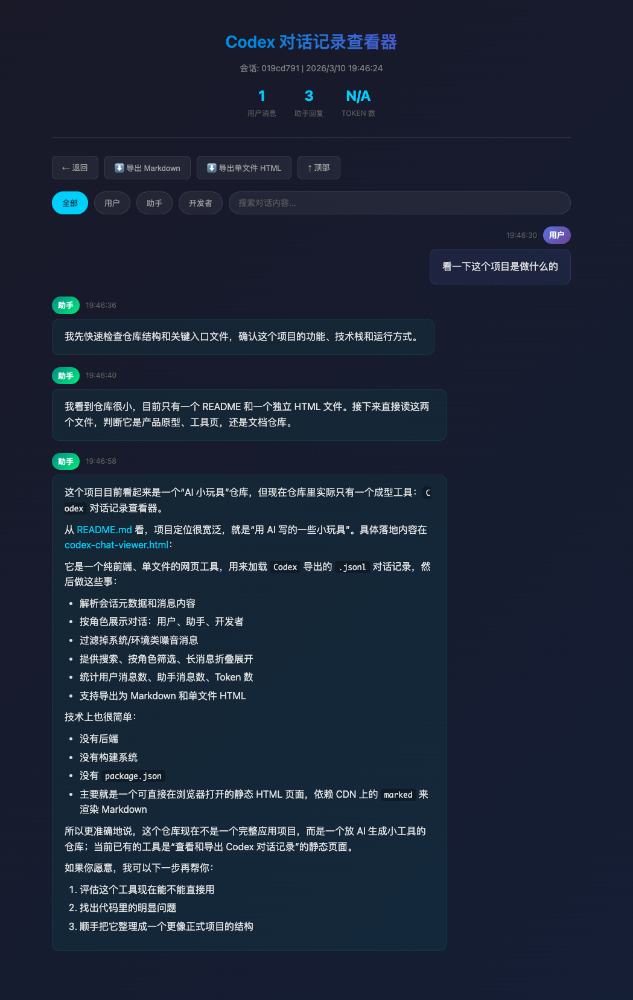

# toybox-ai
Toys written by ai

用ai写的一些小玩具

## 🧩 Codex 对话记录查看器 - [codex-chat-viewer.html](./codex-chat-viewer.html)

Codex Desktop 的会话文件保存在本地 `~/.codex/sessions/` 目录下，但官方客户端无法直接导出或分享完整的对话内容。这个小工具可以直接加载这些 JSONL 文件，将对话以清晰、美观的界面呈现出来，并支持搜索、过滤和 Markdown 渲染。

## 📱 fastTerminal - [fastTerminal](./fastTerminal)

一个面向外接键盘和鼠标优化的 Android SSH 终端。重点解决了移动端终端里常见的两个问题：`Esc` 不会误触发 Android 返回退出，以及鼠标可以像桌面终端一样左键拖拽选中文本、右键就地弹出粘贴。

项目包含完整 Android 工程、Gradle wrapper、预编译 APK 和编译说明，进入 [fastTerminal](./fastTerminal) 目录即可按 README 构建，或者直接下载体验版 APK：[fastTerminal-debug.apk](./fastTerminal/fastTerminal-debug.apk)

演示视频：
[fastTerminal-demo.mp4](./img/fastTerminal-demo.mp4)

<video src="./img/fastTerminal-demo.mp4" controls muted width="360"></video>
