# toybox-ai
Toys written by ai

用 ai 写的一些小玩具

## 🖥️ Chat Viewer 桌面版 - [chat-viewer](./chat-viewer)

基于 Electron 的 Claude Code & Codex 对话记录查看器桌面客户端。支持自动扫描本地对话文件、按项目分组浏览、深色/浅色主题切换、工具消息折叠、搜索过滤，以及 Markdown/HTML 导出。

下载地址：[GitHub Releases](https://github.com/Mrhs121/toybox-ai/releases)（提供 macOS arm64 和 x64 版本）

本地运行：

```bash
cd chat-viewer
npm install
npm start
```

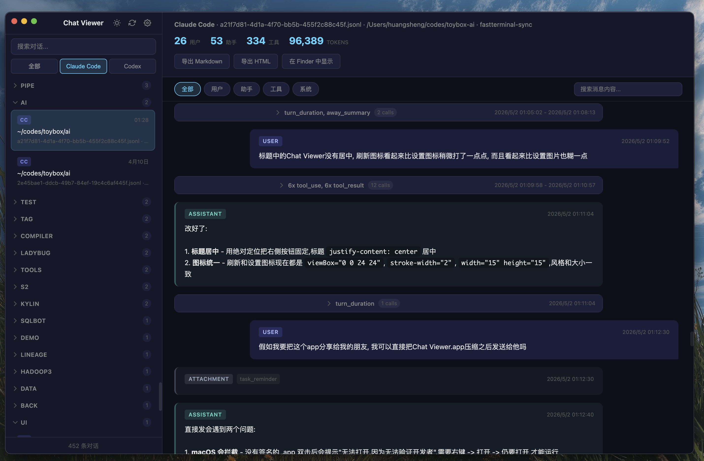

## 🧩 Codex 对话记录查看器 - [codex-chat-viewer.html](./codex-chat-viewer.html)

Codex Desktop 的会话文件保存在本地 `~/.codex/sessions/` 目录下，但官方客户端无法直接导出或分享完整的对话内容。这个小工具可以直接加载这些 JSONL 文件，将对话以清晰、美观的界面呈现出来，并支持搜索、过滤和 Markdown 渲染。


## 💬 LLM Chat - [llm-chat](./llm-chat)

一个 Android 上的大模型聊天客户端，支持接入任意 OpenAI 兼容 API。

**核心特性：**

- **多配置管理** — 添加多个 API 端点（OpenAI、Claude 代理、本地模型等），顶部一键切换
- **流式输出** — 实时逐字显示模型回复，无需等待完整响应
- **Markdown 渲染** — AI 回复支持代码块、标题、列表、加粗、斜体、行内代码等格式
- **文件上传** — 支持上传图片和任意文件（PDF、文档等），图片通过视觉 API 发送，文件通过 base64 传递给模型
- **对话历史** — 侧边栏管理多轮对话，一键切换或删除
- **Material 3 设计** — 深色/浅色主题，流畅动画过渡

下载 APK：[GitHub Releases](https://github.com/Mrhs121/toybox-ai/releases)


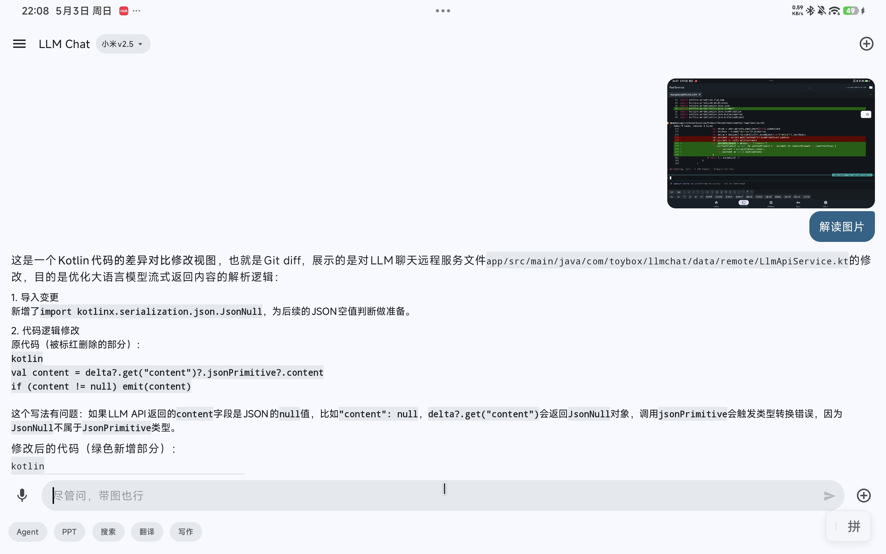

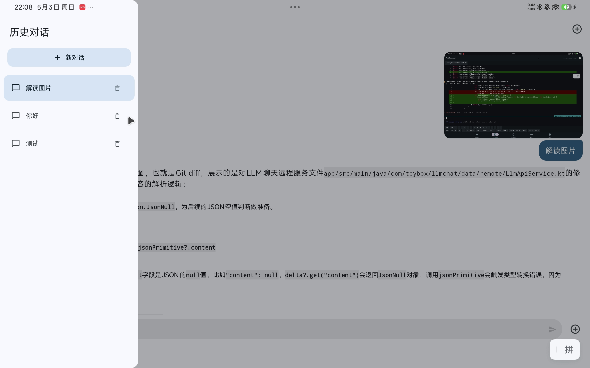

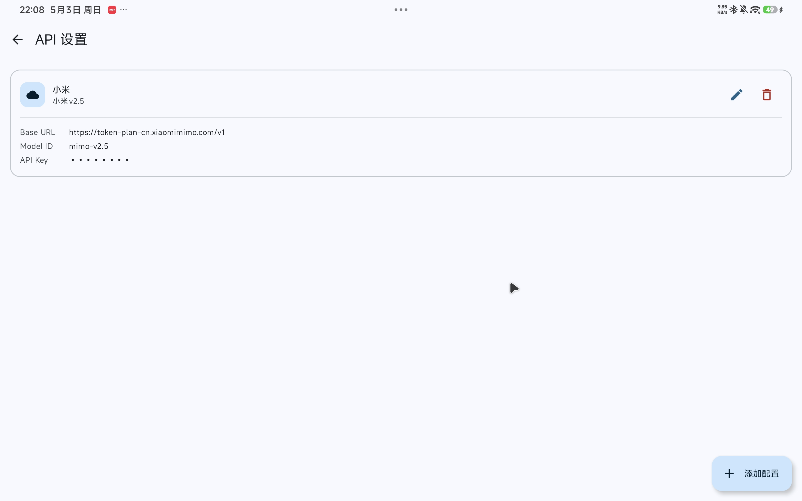

## 📱 FastTerminal - [fastTerminal](./fastTerminal)

一个把 PC 端终端体验搬到 Android 上的 SSH 客户端，专为外接键盘和鼠标设计。

**核心特性：**

- **底部导航栏** — Home、Terminal、Settings、Keys、About 五大面板，启动即显示历史连接，一键直连
- **多 Tab 会话** — 同时打开多条远程连接，顶部 tab 栏快速切换，每个 tab 独立终端内容
- **类 iTerm2 快捷键** — `Ctrl+T` 新建 tab、`Ctrl+W` 关闭 tab、`Ctrl+←/→` 切换 tab，和桌面终端操作习惯一致
- **PC 级复制粘贴** — 鼠标左键拖拽选中文本，右键弹出粘贴菜单；支持 `Ctrl+C/V` 复制粘贴，`Esc` 不会误触发 Android 返回
- **快捷虚拟按键栏** — 底部两行快捷键：特殊字符（`~` `/` `|` `\` 等）、方向键、`Ctrl+C/D/Z` 等组合键，手机软键盘输入不再痛苦
- **Nerd Font 支持** — 内置 JetBrainsMono Nerd Font，远程服务器的 Powerline、文件图标等符号正常显示
- **连接管理** — 保存多个 SSH 连接配置，紧凑 chip 卡片展示，点击即连
- **SFTP 文件浏览器** — 右侧抽屉浏览远程文件，支持上传、下载、新建文件夹、重命名、删除

下载 APK：[GitHub Releases](https://github.com/Mrhs121/toybox-ai/releases)

### 主页 & 连接管理

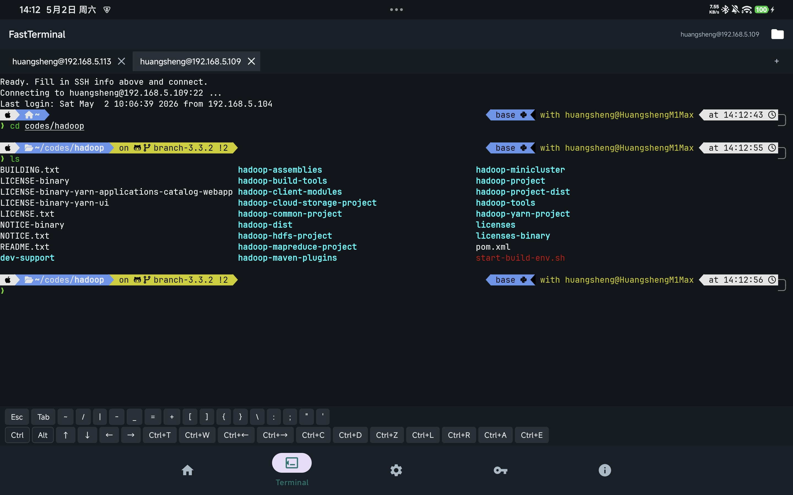

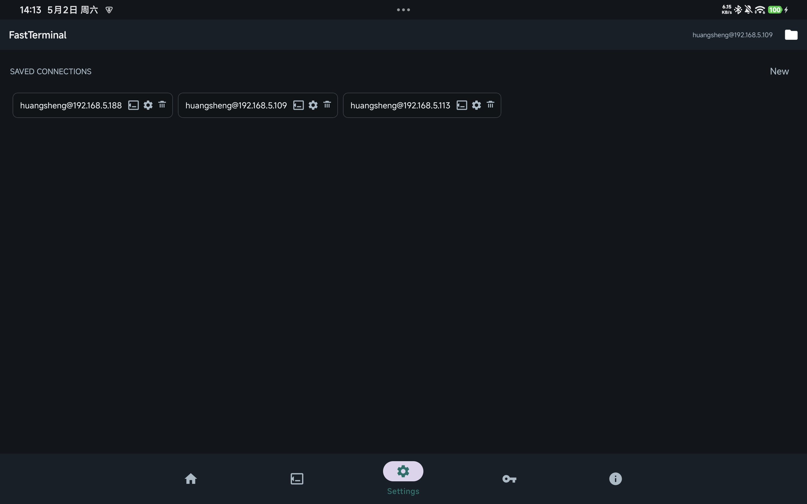

### 终端体验

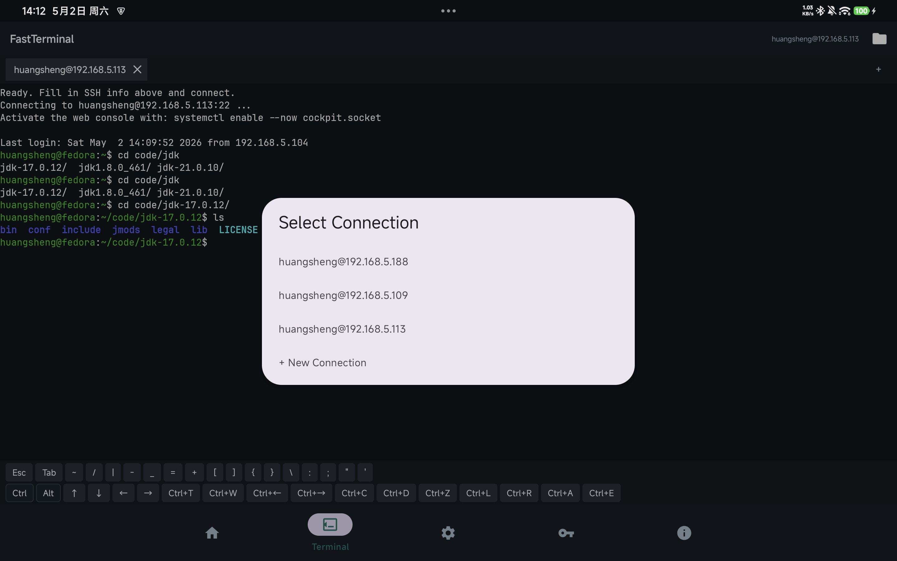

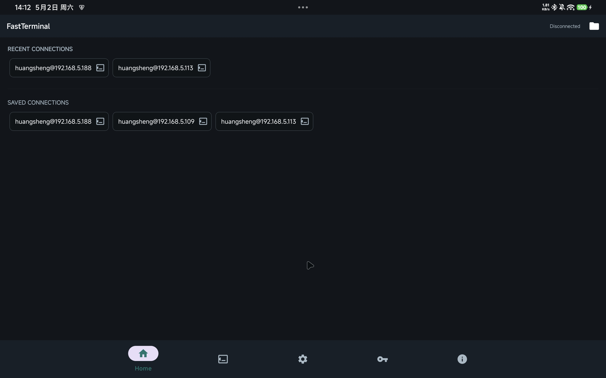

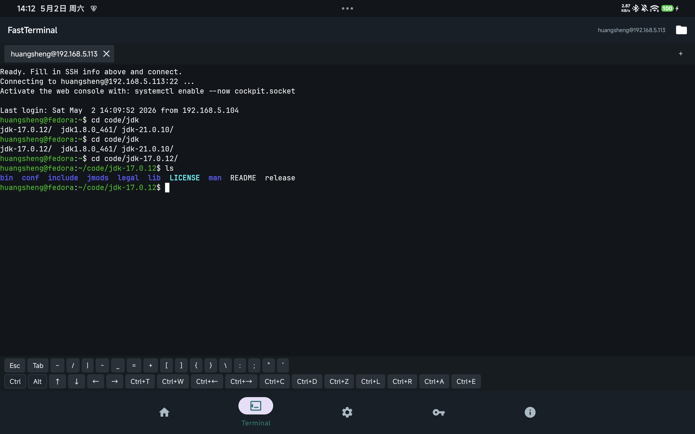

### SFTP 文件浏览器

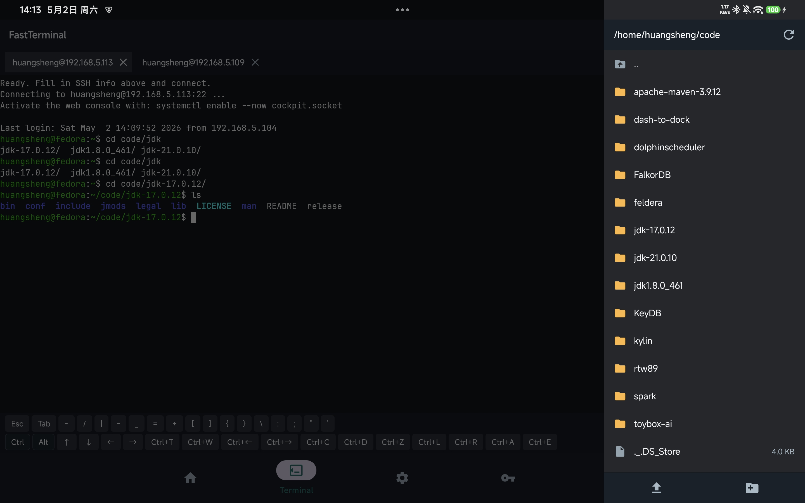

演示预览：
[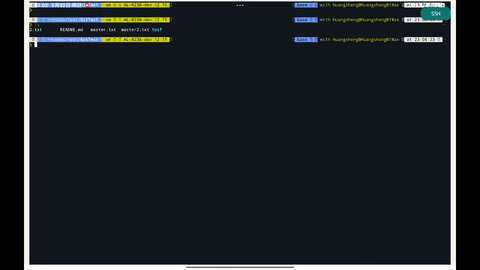](./img/fastTerminal-demo.mp4)

完整视频：
[fastTerminal-demo.mp4](./img/fastTerminal-demo.mp4)
