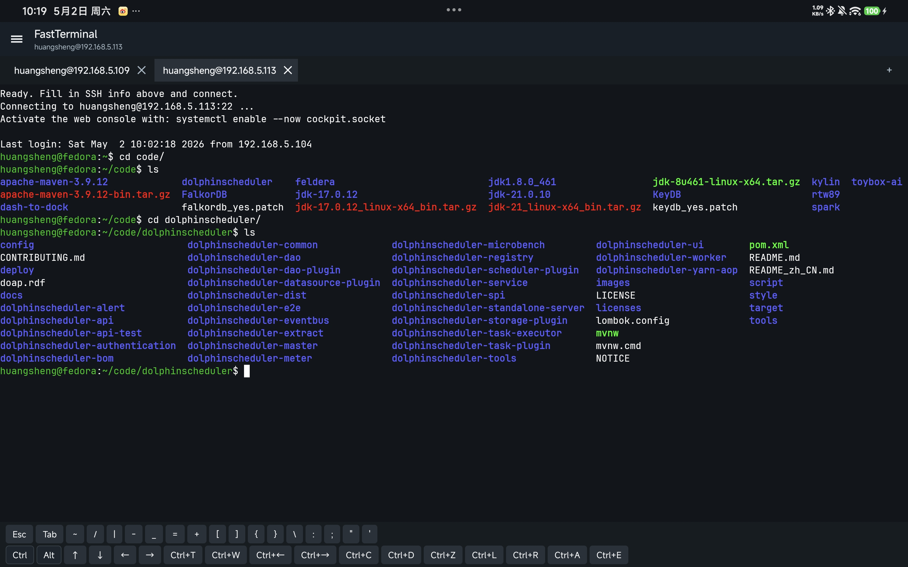
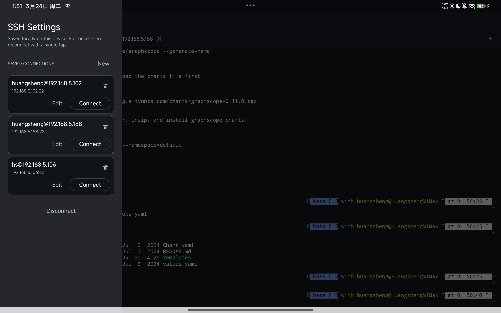

# toybox-ai
Toys written by ai

用 ai 写的一些小玩具

## 🖥️ Chat Viewer 桌面版 - [chat-viewer](./chat-viewer)

基于 Electron 的 Claude Code & Codex 对话记录查看器桌面客户端。支持自动扫描本地对话文件、按项目分组浏览、深色/浅色主题切换、工具消息折叠、搜索过滤，以及 Markdown/HTML 导出。

下载地址：[GitHub Releases](https://github.com/Mrhs121/toybox-ai/releases)（提供 macOS arm64 和 x64 版本）

本地运行：

```bash
cd chat-viewer
npm install
npm start
```


## 🧩 Codex 对话记录查看器 - [codex-chat-viewer.html](./codex-chat-viewer.html)

Codex Desktop 的会话文件保存在本地 `~/.codex/sessions/` 目录下，但官方客户端无法直接导出或分享完整的对话内容。这个小工具可以直接加载这些 JSONL 文件，将对话以清晰、美观的界面呈现出来，并支持搜索、过滤和 Markdown 渲染。


## 📱 FastTerminal - [fastTerminal](./fastTerminal)

一个面向外接键盘和鼠标优化的 Android SSH 终端。重点解决了移动端终端里常见的两个问题：`Esc` 不会误触发 Android 返回退出，以及鼠标可以像桌面终端一样左键拖拽选中文本、右键就地弹出粘贴。

现在还支持多 tab SSH 会话：你可以同时打开多条远程连接，在顶部 tab 栏之间快速切换，每个 tab 保留各自独立的终端内容。

项目包含完整 Android 工程、Gradle wrapper、预编译 APK 和编译说明，进入 [fastTerminal](./fastTerminal) 目录即可按 README 构建，或者直接下载体验版 APK：[fastTerminal-debug.apk](./fastTerminal/fastTerminal-debug.apk)

多 tab 演示：





演示预览：
[](./img/fastTerminal-demo.mp4)

完整视频：
[fastTerminal-demo.mp4](./img/fastTerminal-demo.mp4)
