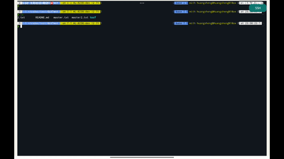
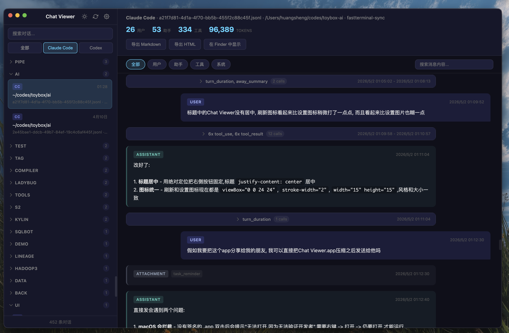
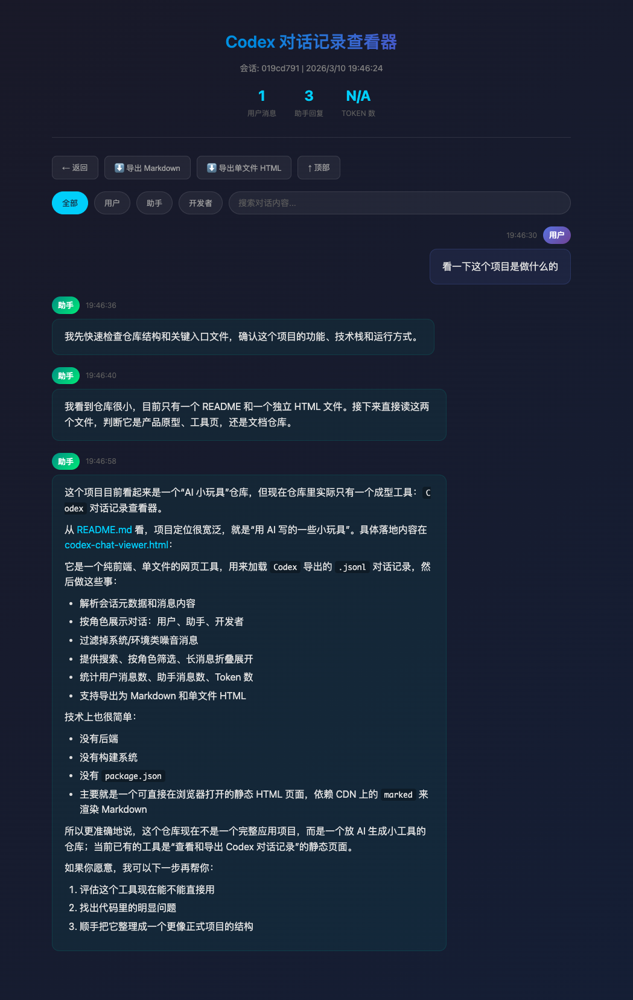
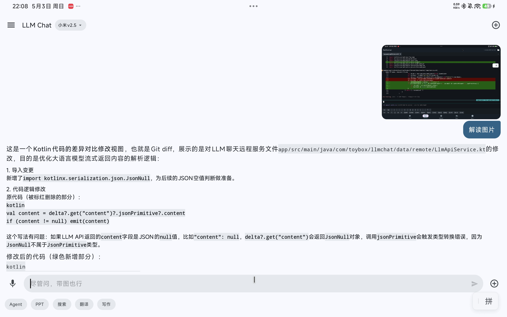
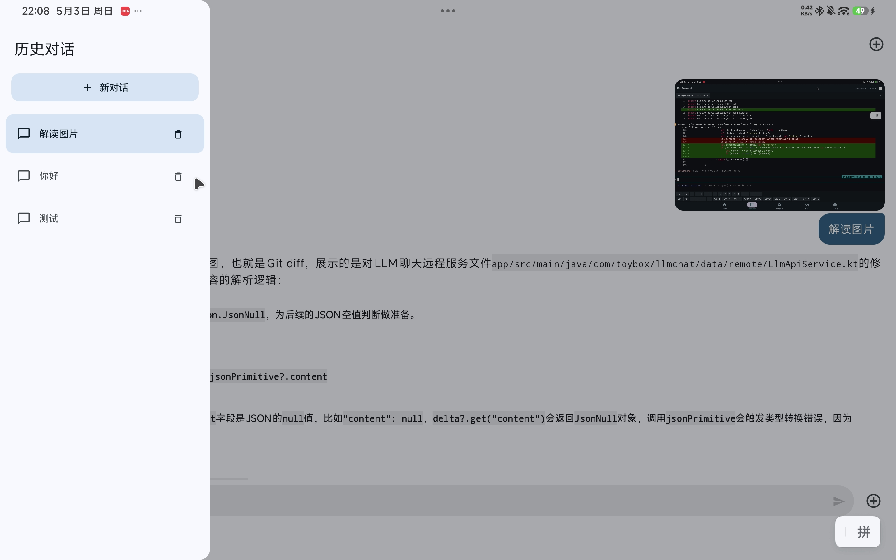
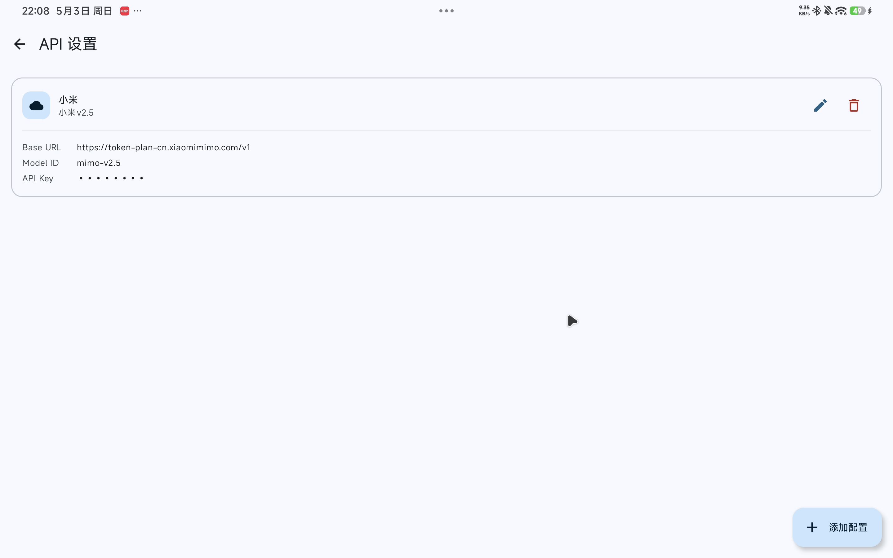
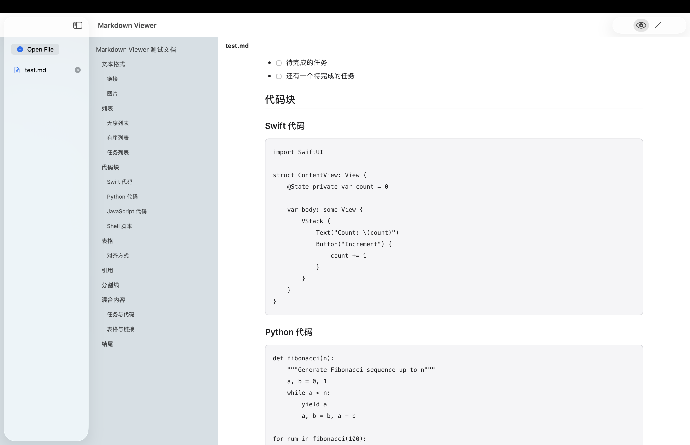
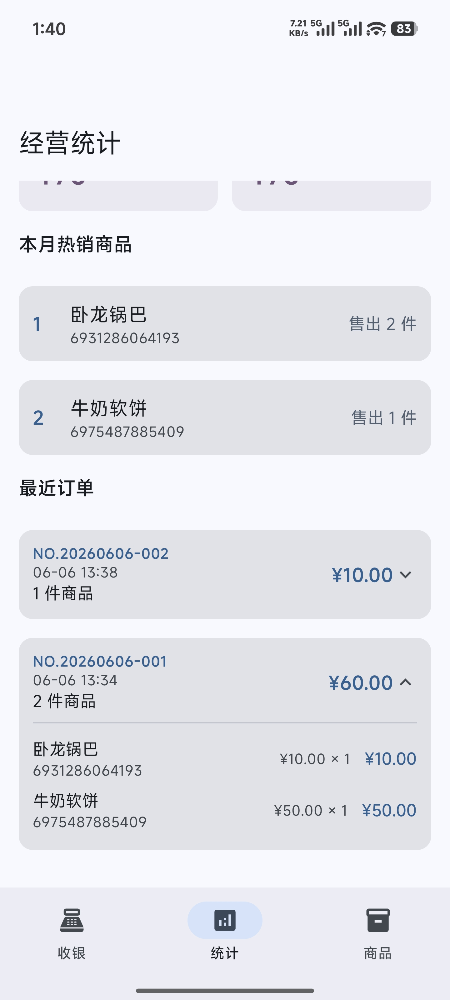

# toybox-ai
Toys written by ai

用 ai 写的一些小玩具

## 📱 FastTerminal - [fastTerminal](./fastTerminal)

一个把 PC 端终端体验搬到 Android 上的 SSH 客户端，专为横屏平板、外接键盘和鼠标设计。

**核心特性：**

- **平板级侧边栏导航** — 服务器列表、终端会话、SFTP 文件传输、偏好与设置四大面板，横屏下使用左侧导航，连接管理更像桌面级生产力工具
- **现代化服务器列表与圆角矩阵** — 20dp 卡片超椭圆圆角设计，单行内嵌式搜索与过滤胶囊（全部 / ⭐ 常用 / 🏠 局域网 / 🚀 云端），实时显示在线状态、延迟与最近连接时间
- **终端多主题实时切换** — 内置 One Dark、Tokyo Night、Catppuccin Mocha、Dracula、Solarized Dark、Nord、Monokai 等 7 大经典配色，支持实时下拉切换
- **多 Tab 会话管理** — 同时打开多条远程连接，顶部 Tab 栏快速切换，支持 `Ctrl+T` 新建、`Ctrl+W` 关闭、`Ctrl+←/→` 快速切换
- **机械按键质感快捷栏** — 底部两行快捷键（特殊字符、修饰键、方向键、常用组合键及一键宏），手机与平板软键盘输入极度舒适
- **PC 级鼠标交互与剪贴板** — 鼠标左键拖拽选中文本，右键弹出粘贴菜单；支持 `Ctrl+C/V` 快捷键，物理 `Esc` 键不会误触 Android 返回
- **伴随式 SFTP 文件浏览器** — 平板横屏下伴随终端分屏展示，支持远程文件浏览、面包屑导航、文件上传、新建文件夹、重命名与删除
- **Nerd Font 字体支持** — 内置 JetBrainsMono Nerd Font，终端下 Powerline、Starship 提示符与开发图标完美渲染

下载 APK：[GitHub Releases](https://github.com/Mrhs121/toybox-ai/releases)

### 界面预览

| 服务器列表 (Connections) | 终端会话 (Terminal) |
|:---:|:---:|
|  |  |

| SFTP 文件传输 (SFTP Browser) | 偏好与设置 (Settings) |
|:---:|:---:|
|  |  |

演示预览：
[](./img/fastTerminal-demo.mp4)

完整视频：
[fastTerminal-demo.mp4](./img/fastTerminal-demo.mp4)

## 🖥️ Chat Viewer 桌面版 - [chat-viewer](./chat-viewer)

基于 Electron 的 Claude Code & Codex 对话记录查看器桌面客户端。支持自动扫描本地对话文件、按项目分组浏览、深色/浅色主题切换、工具消息折叠、搜索过滤，以及 Markdown/HTML 导出。

下载地址：[GitHub Releases](https://github.com/Mrhs121/toybox-ai/releases)（提供 macOS arm64 和 x64 版本）

本地运行：

```bash
cd chat-viewer
npm install
npm start
```



## 🧩 Codex 对话记录查看器 - [codex-chat-viewer.html](./codex-chat-viewer.html)

Codex Desktop 的会话文件保存在本地 `~/.codex/sessions/` 目录下，但官方客户端无法直接导出或分享完整的对话内容。这个小工具可以直接加载这些 JSONL 文件，将对话以清晰、美观的界面呈现出来，并支持搜索、过滤和 Markdown 渲染。



## 💬 LLM Chat - [llm-chat](./llm-chat)

一个 Android 上的大模型聊天客户端，支持接入任意 OpenAI 兼容 API。

**核心特性：**

- **多配置管理** — 添加多个 API 端点（OpenAI、Claude 代理、本地模型等），顶部一键切换
- **流式输出** — 实时逐字显示模型回复，无需等待完整响应
- **Markdown 渲染** — AI 回复支持代码块、标题、列表、加粗、斜体、行内代码等格式
- **文件上传** — 支持上传图片和任意文件（PDF、文档等），图片通过视觉 API 发送，文件通过 base64 传递给模型
- **对话历史** — 侧边栏管理多轮对话，一键切换或删除
- **Material 3 设计** — 深色/浅色主题，流畅动画过渡

下载 APK：[GitHub Releases](https://github.com/Mrhs121/toybox-ai/releases)








## 📝 Markdown Viewer - [markdown-viewer](./markdown-viewer)

macOS Markdown 查看器与编辑器，支持完整的 GFM (GitHub Flavored Markdown) 语法。

**核心特性：**

- **完整 Markdown 渲染** — 支持表格、任务列表、代码高亮、删除线等 GFM 语法
- **目录导航** — 自动提取标题生成目录，点击跳转到对应章节
- **编辑模式** — 支持实时编辑 Markdown 并预览效果
- **拖拽支持** — 直接拖拽文件到窗口打开
- **文件管理** — 支持打开多个文件，在侧边栏切换

系统要求：macOS 14.0 (Sonoma) 或更高版本

本地运行：

```bash
cd markdown-viewer
swift build
swift run MarkdownViewer
```



## 🏪 Mini POS 小店收银 - [mini-pos](./mini-pos)

一个专为小超市、便利店、小卖铺设计的 Android 收银 App。

**核心特性：**

- **连续扫码收银** — 打开扫码界面后连续扫描商品条码，自动添加到购物车，扫码成功有声音提示
- **前后摄像头切换** — 支持切换前置/后置摄像头，前置镜像显示，自动对焦 + 点击对焦
- **商品管理** — 扫码或手动添加商品，支持条码、名称、价格、分类，搜索过滤
- **收款码管理** — 上传多个平台收款码（微信、支付宝等），结算时展示并支持 Tab 切换
- **经营统计** — 今日/本周/本月销售额、订单数、热销商品排行
- **订单明细** — 带订单编号，点击展开查看商品明细

下载 APK：[GitHub Releases](https://github.com/Mrhs121/toybox-ai/releases)

| 收银台 | 扫码结算 | 商品管理 |
|:---:|:---:|:---:|
|  |  |  |

| 收款码结算 | 经营分析 | 订单明细 |
|:---:|:---:|:---:|
|  |  |  |
