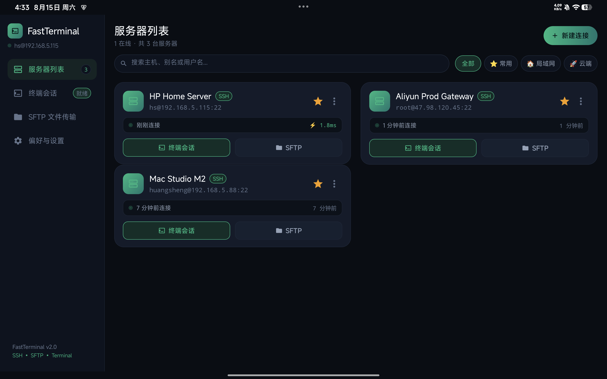
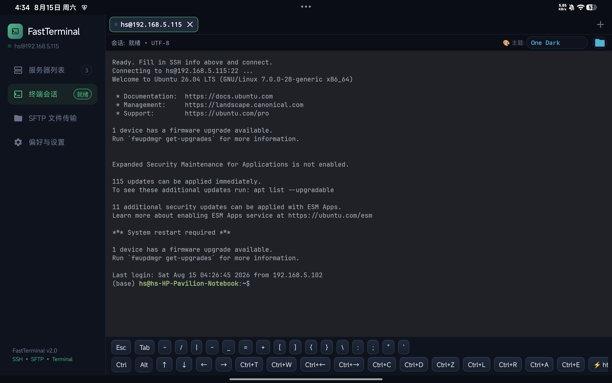
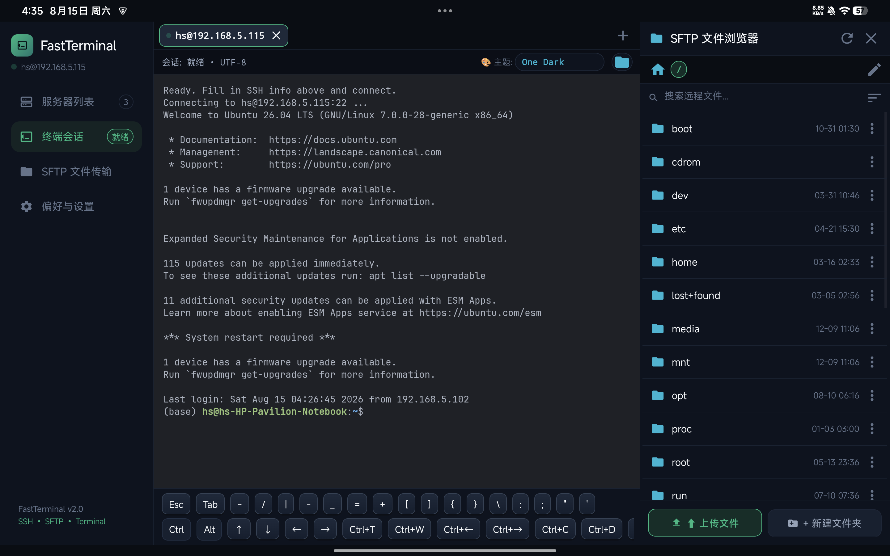
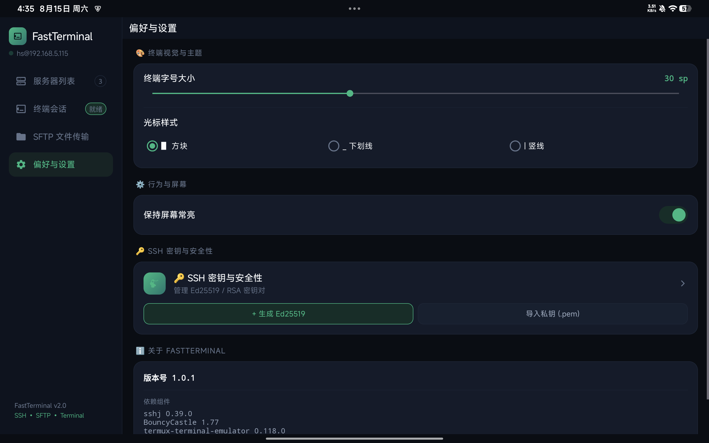

# FastTerminal

FastTerminal 是一款专为 Android 横屏平板、外接键盘与鼠标打造的现代化桌面级 SSH 终端与 SFTP 客户端。

## 🌟 核心特性

- **现代深邃视觉体系** — 采用深邃夜空黑 `#06080F` 底色与柔和边框，卡片超椭圆圆角（20dp）与状态栏（10dp）视觉矩阵。
- **平板级侧边栏导航** — 整合「服务器列表」、「终端会话」、「SFTP 文件传输」、「偏好与设置」四大面板，横屏下操作畅快。
- **现代化服务器列表与单行过滤** — 搜索栏与 `[全部]` `[⭐ 常用]` `[🏠 局域网]` `[🚀 云端]` 胶囊按钮单行融合，清晰展示主机、在线状态、延迟与最近连接。
- **终端多主题实时切换** — 内置 One Dark、Tokyo Night、Catppuccin Mocha、Dracula、Solarized Dark、Nord、Monokai 7 款经典终端配色，支持会话头部实时切换。
- **多 Tab 会话与类 iTerm 快捷键** — 支持多 Tab 会话管理，`Ctrl+T` 新建、`Ctrl+W` 关闭、`Ctrl+←/→` 左右切换 Tab。
- **PC 级键鼠交互** — 物理 `Esc` 专供终端拦截，鼠标左键拖拽选中文本，右键菜单快速粘贴，支持标准 `Ctrl+C/V`。
- **机械按键质感快捷栏** — 底部双行快捷键（特殊字符、修饰键、方向键、组合键、htop/docker/git 常用宏），软键盘输入极度便捷。
- **伴随式 SFTP 文件浏览器** — 横屏下右侧伴随式分屏文件浏览器，支持远程目录树、面包屑跳转、文件上传、新建文件夹、重命名与删除。
- **Nerd Font 字体支持** — 内置 JetBrainsMono Nerd Font，Powerline、Starship 提示符与开发文件图标精准渲染。
- **后台保活服务** — 前台服务保障 SSH 与长任务在后台平稳运行不掉线。

## 📸 界面预览

| 服务器列表 (Connections) | 终端会话 (Terminal) |
|:---:|:---:|
|  |  |

| SFTP 文件传输 (SFTP Browser) | 偏好与设置 (Settings) |
|:---:|:---:|
|  |  |

---

## 🛠️ 构建与安装

### 构建依赖
- JDK 17
- Android SDK (`platforms;android-35`, `build-tools;35.0.0`)
- `local.properties` (配置 `sdk.dir=/path/to/android-sdk`)

### 编译 Debug APK
```bash
./gradlew :app:assembleDebug
```

### 安装到设备
```bash
adb install -r app/build/outputs/apk/debug/app-debug.apk
```


