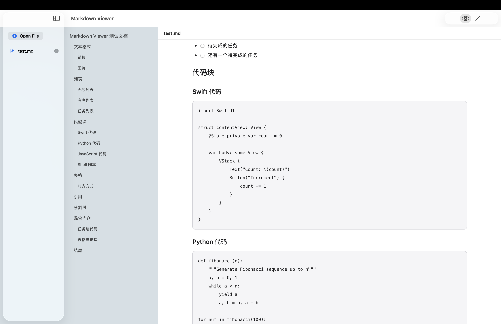

# Markdown Viewer

macOS Markdown 查看器与编辑器，支持完整的 GFM (GitHub Flavored Markdown) 语法。



## 功能特性

- **完整 Markdown 渲染** — 支持表格、任务列表、代码高亮、删除线等 GFM 语法
- **目录导航** — 自动提取标题生成目录，点击跳转到对应章节
- **编辑模式** — 支持实时编辑 Markdown 并预览效果
- **拖拽支持** — 直接拖拽文件到窗口打开
- **文件管理** — 支持打开多个文件，在侧边栏切换

## 系统要求

- macOS 14.0 (Sonoma) 或更高版本

## 构建

```bash
cd markdown-viewer
swift build
swift run MarkdownViewer
```

或使用构建脚本打包为 .app：

```bash
bash build-app.sh
open .build/MarkdownViewer.app
```

## 项目结构

```
Sources/MarkdownViewer/
├── MarkdownViewerApp.swift        # App 入口
├── Models/
│   └── AppState.swift             # 全局状态管理
├── ViewModels/
│   └── MarkdownParser.swift       # Markdown 解析 (cmark-gfm)
├── Views/
│   ├── ContentView.swift          # 主界面布局
│   ├── Sidebar/
│   │   └── FileTreeView.swift     # 文件列表
│   ├── Detail/
│   │   ├── MarkdownDetailView.swift
│   │   ├── MarkdownPreviewView.swift
│   │   ├── MarkdownEditorView.swift
│   │   └── TOCView.swift          # 目录导航
│   └── Toolbar/
│       └── EditPreviewToolbar.swift
└── Resources/
    ├── template.html              # HTML 渲染模板
    └── AppIcon.icns               # 应用图标
```

## 技术栈

- **SwiftUI** — 原生 macOS UI 框架
- **cmark-gfm** — GitHub Flavored Markdown 解析库
- **WKWebView** — HTML 渲染引擎

## License

MIT
